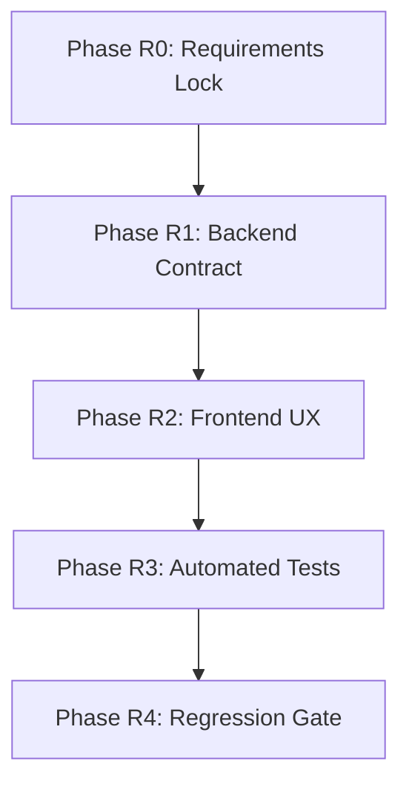

---

# Feature Track: Item Reassignment Selector (Exclude Current Assignee)

> **Feature:** Allow reassigning receipt items to different people via selector (excluding current assignee)
> **Status:** Planning
> **Reference:** [requirements.md](./requirements.md) (Section: Editable Receipt Items → Item Reassignment)
> **Parent Track:** Manual Editing of Extracted Receipt Items

## 🛡️ Guard Rails (MANDATORY)

> [!IMPORTANT]
> These rules MUST be enforced throughout all phases of this feature track.

### Scope Limits (NO EXPANSION)

- ❌ NO multi-assign (item assigned to multiple people)
- ❌ NO split item (divide quantity across people)
- ❌ NO add/remove people from the bill
- ❌ NO reset-to-original button (out of scope)
- ❌ NO undo/redo functionality
- ✅ ONLY implement single item reassignment to one other person

### Technical Constraints

- ✅ shadcn-only (no new UI libraries)
- ✅ Supabase-only (no new storage systems)
- ✅ Use existing `result_data` / `original_result_data` pattern
- ✅ Use existing recalculation utility (`src/lib/utils/recalculate.ts`)

### Anti-Hallucination Rules

- If any detail is ambiguous → STOP and log question in `execution-progress.md`
- Do NOT invent requirements
- Do NOT add "nice-to-have" features
- If blocked for 3 attempts → STOP and escalate

### LLM Guard Rails

- LLM MUST NOT be re-invoked after reassignment
- LLM MUST NOT validate reassignment logic
- Reassignment is authoritative user input

## 🔌 MCP Usage Strategy

| MCP                | Purpose                                                                   |
| ------------------ | ------------------------------------------------------------------------- |
| **Context7 MCP**   | Confirm shadcn Select/Combobox patterns                                   |
| **Supabase MCP**   | Validate `result_data` structure, immutability rules, seed data for tests |
| **Playwright MCP** | Validate selector/recalc test approach                                    |
| **Serena MCP**     | Track dependencies and ownership                                          |

If any MCP unavailable, note assumption and proceed.

---

## Phase R0: Requirements Lock & Acceptance Criteria 📝

**Owner:** Orchestrator + QA
**Dependencies:** Requirements.md Item Reassignment section (complete)

### Objective

Extract exact rules from requirements.md into testable acceptance criteria. No reinterpretation.

### Checklist

- [ ] Extract selector behavior rules:
  - [ ] Selector list includes all other people (NOT current assignee)
  - [ ] Label is clear (e.g., "Reassign to" or "Assigned to")
  - [ ] Selector only visible in edit mode
  - [ ] Default shows current assignment
- [ ] Extract recalculation expectations:
  - [ ] Item removed from original person's breakdown
  - [ ] Item added to new person's breakdown
  - [ ] Both persons' subtotals recalculated
  - [ ] Tax/service fee redistributed proportionally
  - [ ] Grand total verified (should be unchanged)
- [ ] Extract persistence expectations:
  - [ ] `result_data` updated with reassignment
  - [ ] `original_result_data` remains immutable
- [ ] Define Gherkin scenario titles (reassignment-specific only)
- [ ] Confirm no LLM involvement post-reassignment

### Gherkin Scenario Titles (Reassignment)

1. `Scenario: Reassignment selector excludes current assignee`
2. `Scenario: Reassigning item updates both persons' totals`
3. `Scenario: Reassigned item disappears from original person`
4. `Scenario: Reassigned item appears under new person`
5. `Scenario: Reassignment persists after page reload`
6. `Scenario: No AI API call triggered by reassignment`
7. `Scenario: Reassigned item displays edited indicator`
8. `Scenario: Grand total unchanged after reassignment`

### Exit Criteria

- [ ] Acceptance criteria documented and approved
- [ ] Gherkin scenarios approved
- [ ] No ambiguities (or questions logged and answered)

### Rollback Notes

If requirements unclear, escalate to user before proceeding.

---

## Phase R1: Backend/Data Contract Readiness 🗄️

**Owner:** Backend + Data
**Dependencies:** Phase R0 complete

### Objective

Confirm data model supports reassignment without schema changes.

### Checklist

- [ ] Verify `Person` structure in `result_data`:
  - [ ] `name` field identifies person
  - [ ] `foodItems` and `drinkItems` arrays hold items
  - [ ] Items have `id` field for unique identification
- [ ] Verify existing `PATCH /api/update-result` endpoint can handle:
  - [ ] Reassigned item moving between persons
  - [ ] Full `result_data` replacement (not incremental)
- [ ] Confirm server-side validation:
  - [ ] Rejects invalid person names
  - [ ] Validates item structure
  - [ ] Does NOT re-invoke LLM
- [ ] Confirm `original_result_data` immutability enforced

### MCP Validation

- [ ] Use **Supabase MCP** to inspect current `split_bill_results` table structure
- [ ] Use **Supabase MCP** to validate `result_data` JSON shape

### Exit Criteria

- [ ] Data contract confirmed (no schema changes needed)
- [ ] Endpoint validation rules documented
- [ ] Immutability guarantee verified

### Rollback Notes

If schema changes needed, create migration plan and escalate.

---

## Phase R2: Frontend Edit Mode UX for Reassignment 🎨

**Owner:** Frontend
**Dependencies:** Phase R1 complete

### Objective

Implement assignment selector in edit dialog using shadcn components.

### Checklist

- [ ] Update `EditItemDialog.svelte`:
  - [ ] Add shadcn `Select` for assignment field
  - [ ] Populate options with all people EXCEPT current assignee
  - [ ] Label: "Reassign to" or "Assigned to"
  - [ ] Default value: current assignment (display only, not selectable)
- [ ] Selector visibility:
  - [ ] Selector MUST only appear in edit mode (via dialog)
  - [ ] Non-edit mode shows assignment as read-only text
- [ ] Handle reassignment:
  - [ ] On save, move item from source person to target person
  - [ ] Use existing `recalculate.ts` utility
  - [ ] Update both persons' subtotals, tax, serviceFee, total
  - [ ] Verify grand total unchanged
- [ ] Edited indicator:
  - [ ] Reassigned items display "Edited" badge
  - [ ] Use existing `isEdited` flag pattern
- [ ] Strict shadcn compliance:
  - [ ] `Select`, `SelectTrigger`, `SelectContent`, `SelectItem`
  - [ ] `FormMessage` for validation errors
  - [ ] `Label` for field label

### MCP Validation

- [ ] Use **Context7 MCP** to confirm shadcn Select pattern
- [ ] Use **Playwright MCP** to confirm selector testability

### Exit Criteria

- [ ] Assignment selector implemented and functional
- [ ] Recalculation verified in UI
- [ ] shadcn compliance checklist passed
- [ ] No changes leak to non-edit mode

### Rollback Notes

If shadcn Select insufficient, consider Combobox. Do NOT use non-shadcn components.

---

## Phase R3: Automated Tests (Playwright + Gherkin) 🧪

**Owner:** QA
**Dependencies:** Phase R2 complete

### Objective

Implement Playwright tests for all reassignment Gherkin scenarios.

### Test File

Update `tests/manual-edit.spec.ts` with reassignment tests.

### Checklist

- [ ] Test: Selector excludes current assignee
  - [ ] Open edit dialog for item assigned to "Alice"
  - [ ] Verify "Alice" NOT in dropdown options
  - [ ] Verify other people (e.g., "Bob") ARE in dropdown
- [ ] Test: Reassignment updates both persons' totals
  - [ ] Reassign item from Alice to Bob
  - [ ] Verify Alice's total decreased
  - [ ] Verify Bob's total increased
  - [ ] Verify grand total unchanged
- [ ] Test: Reassigned item moves between persons
  - [ ] Item no longer in Alice's list
  - [ ] Item now in Bob's list
- [ ] Test: Reassignment persists after reload
  - [ ] Save reassignment
  - [ ] Reload page
  - [ ] Verify item still under new person
- [ ] Test: No AI API call triggered
  - [ ] Intercept `/api/split-bill` or OpenRouter calls
  - [ ] Verify no calls made during reassignment
- [ ] Test: Reassigned item shows edited indicator
  - [ ] Verify "Edited" badge displayed

### Test Data Strategy

- [ ] Use **Supabase MCP** for deterministic seed data
- [ ] Create test record with 2+ people
- [ ] Each person has at least 1 item

### Exit Criteria

- [ ] All 6+ reassignment tests pass
- [ ] Tests are deterministic (no flakiness)
- [ ] Tests follow `agents.md` conventions

### Rollback Notes

If tests fail, log attempt in `execution-progress.md`. Max 3 attempts before escalation.

---

## Phase R4: Regression Gate 🛡️

**Owner:** QA + Orchestrator
**Dependencies:** Phase R3 complete

### Objective

Run full test suite to ensure reassignment doesn't break existing functionality.

### Checklist

- [ ] Run reassignment test suite
- [ ] Run existing manual-edit tests (name/price/quantity)
- [ ] Run public/private access tests
- [ ] Run brute-force protection tests
- [ ] Run payment instruction tests
- [ ] Run split-bill creation tests

### Regression Verification

- [ ] No AI re-execution (guard rail)
- [ ] No breakage to public/private result flows
- [ ] No calculation drift (grand totals stable)
- [ ] No UI regressions (shadcn compliance)

### Commands

```bash
# Run all tests
pnpm exec playwright test

# Run reassignment tests only
pnpm exec playwright test tests/manual-edit.spec.ts

# Run with UI for debugging
pnpm exec playwright test --ui
```

### Exit Criteria

- [ ] All tests pass (100% green)
- [ ] No regressions logged
- [ ] Feature cleared for merge

### Rollback Notes

If regressions found:

1. Log failing test in `execution-progress.md`
2. Identify root cause
3. Fix and re-run (max 3 attempts)
4. If still failing, escalate

---

## Summary: Phase Dependencies



## Owner Assignment

| Phase | Owner             | Agent Type     |
| ----- | ----------------- | -------------- |
| R0    | Orchestrator + QA | Spec Author    |
| R1    | Backend + Data    | Backend Agent  |
| R2    | Frontend          | Frontend Agent |
| R3    | QA                | QA Agent       |
| R4    | QA + Orchestrator | Gatekeeper     |
