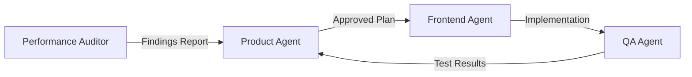

# Execution Plan: Frontend Performance Optimization

> **Reference:** Based on [Performance Audit Report](file:///Users/panji.gautama/.gemini/antigravity/brain/b2a15ed6-a54f-450c-951f-9e16d7005500/performance-audit-report.md)
> **Created:** 2026-01-15
> **Status:** Planning

---

## 🛡️ Guard Rails (MANDATORY)

> [!CAUTION]
> These rules apply to ALL phases and CANNOT be bypassed.

### Agent Role Boundaries

| Agent | Allowed | Forbidden |
|-------|---------|-----------|
| **Frontend Agent** | Extract components, move utilities, modify animations | Add new libraries, change data fetching patterns, modify server code |
| **QA Agent** | Write tests for refactored components | Modify implementation code |
| **Product Agent** | Approve scope changes | Write code |

### LLM Guard Rails

- **DO NOT** add new dependencies without explicit user approval
- **DO NOT** change data fetching patterns (server-side load functions are correct)
- **DO NOT** modify API endpoints or backend logic
- **DO NOT** alter Supabase queries or RLS policies
- **DO NOT** break existing functionality — all changes must be backwards-compatible
- **DO NOT** remove existing features or UI elements

### Quality Gates

- All changes must pass `pnpm check` (TypeScript)
- All changes must pass `pnpm build` (Production build)
- Existing Playwright tests must continue to pass
- No visual regressions in UI

---

## 📊 Priority Matrix

Based on audit findings, prioritized by impact and effort:

| Priority | Finding | Severity | Effort | Phase |
|----------|---------|----------|--------|-------|
| 1 | Animation stagger delay cap | Medium | Low | Phase 1 |
| 2 | Extract shared utilities | Low | Low | Phase 2 |
| 3 | Component extraction (Result page) | Low | Medium | Phase 3 |

---

## Phase 1: Animation Performance 🎯

**Owner:** Frontend Agent  
**Effort:** ~30 minutes  
**Risk:** Low

### Objective

Cap staggered animation delays on the result page to prevent cumulative delays for large lists.

### Tasks

- [x] **1.1** Locate animation in `src/routes/result/[id]/+page.svelte` (lines 335-337)
- [x] **1.2** Modify delay calculation: `delay: Math.min(i * 80, 400)`
- [x] **1.3** Verify change with visual inspection

### Proposed Change

```svelte
<!-- BEFORE -->
<div in:slide={{ delay: i * 80, duration: 250 }}>

<!-- AFTER -->
<div in:slide={{ delay: Math.min(i * 80, 400), duration: 250 }}>
```

### Exit Criteria

- [x] Build passes
- [x] Result page loads with 10+ people without excessive delay
- [x] Animations still provide visual feedback

---

## Phase 2: Utility Consolidation 🧹

**Owner:** Frontend Agent  
**Effort:** ~1 hour  
**Risk:** Low

### Objective

Extract duplicated utilities to shared location for maintainability.

### Tasks

- [x] **2.1** Create/update `src/lib/utils.ts` with shared utilities
- [x] **2.2** Add `formatCurrency(amount: number, currency?: string)` function
- [x] **2.3** Add `avatarColors` constant array
- [x] **2.4** Update imports in:
  - [x] `src/routes/result/[id]/+page.svelte`
  - [x] `src/routes/admin/dashboard/bills/+page.svelte`
  - [x] `src/routes/admin/dashboard/bills/[id]/+page.svelte`
- [x] **2.5** Remove duplicate definitions from components

### Guard Rails

- Utility functions must maintain exact same behavior
- Default currency must remain "USD" to avoid breaking changes
- `avatarColors` order must not change (affects existing result displays)

### Exit Criteria

- [x] No duplicate `formatCurrency` functions in codebase
- [x] Type check passes
- [x] Build passes

---

## Phase 3: Component Extraction (Optional) 📦

**Owner:** Frontend Agent  
**Effort:** ~2-3 hours  
**Risk:** Medium

> [!IMPORTANT]
> This phase is **optional** and may be deferred. Proceed only if approved.

### Objective

Split large result page into smaller, focused components.

### Proposed Components

| Component | Responsibility | Lines Affected |
|-----------|---------------|----------------|
| `PasscodePrompt.svelte` | Passcode entry UI | ~70 lines |
| `PersonCard.svelte` | Individual person breakdown | ~130 lines |
| `PaymentInstructionCard.svelte` | Payment display + copy | ~35 lines |
| `ReceiptCard.svelte` | Receipt image display | ~20 lines |
| `FloatingBottomBar.svelte` | Grand total + share actions | ~50 lines |

### Tasks

- [ ] **3.1** Create component files in `src/lib/components/result/`
- [ ] **3.2** Extract `PasscodePrompt.svelte`
- [ ] **3.3** Extract `PersonCard.svelte`
- [ ] **3.4** Extract `PaymentInstructionCard.svelte`
- [ ] **3.5** Extract `ReceiptCard.svelte`
- [ ] **3.6** Extract `FloatingBottomBar.svelte`
- [ ] **3.7** Update main result page to compose from child components
- [ ] **3.8** Verify all props and events work correctly

### Guard Rails

- Props interface must be strictly typed
- Event handlers must be forwarded correctly
- Animations must continue to work
- No visual changes to UI

### Exit Criteria

- [ ] All Playwright tests pass
- [ ] Visual parity with current implementation
- [ ] Type check passes
- [ ] Build passes

---

## 📋 Test Requirements

### Phase 1 Tests

No new tests required — existing tests should continue to pass.

### Phase 2 Tests

- [ ] Unit tests for `formatCurrency` utility (Vitest)
- [ ] Verify existing Playwright tests pass

### Phase 3 Tests

- [ ] Playwright tests for result page interactions
- [ ] Component unit tests (optional, Vitest)

---

## 🤖 Multi-Agent Workflow

### Handoff Protocol



### Agent Communication Format

When handing off between agents, include:

1. **Context**: What was done and why
2. **Scope**: Exact files and changes allowed
3. **Constraints**: What NOT to change
4. **Exit Criteria**: How to know when done

### Phase Ownership

| Phase | Primary Owner | Reviewer |
|-------|--------------|----------|
| Phase 1 | Frontend Agent | QA Agent |
| Phase 2 | Frontend Agent | QA Agent |
| Phase 3 | Frontend Agent | Product Agent + QA Agent |

---

## ⏱️ Estimated Timeline

| Phase | Estimated Time | Dependencies |
|-------|---------------|--------------|
| Phase 1 | 30 min | None |
| Phase 2 | 1 hour | None |
| Phase 3 | 2-3 hours | User approval |
| **Total** | ~4 hours max | |

---

## 🚫 Out of Scope

The following are explicitly **NOT** part of this optimization effort:

- Server-side data fetching changes
- API endpoint modifications
- Database schema changes
- New library/dependency additions
- Bundle size optimization (no issues found)
- Supabase query optimization

---

## ✅ Approval Checklist

Before proceeding to execution:

- [ ] User approves Phase 1 (Animation cap)
- [ ] User approves Phase 2 (Utility extraction)
- [ ] User decides on Phase 3 (Component extraction — optional)
- [ ] Guard rails are understood and accepted
